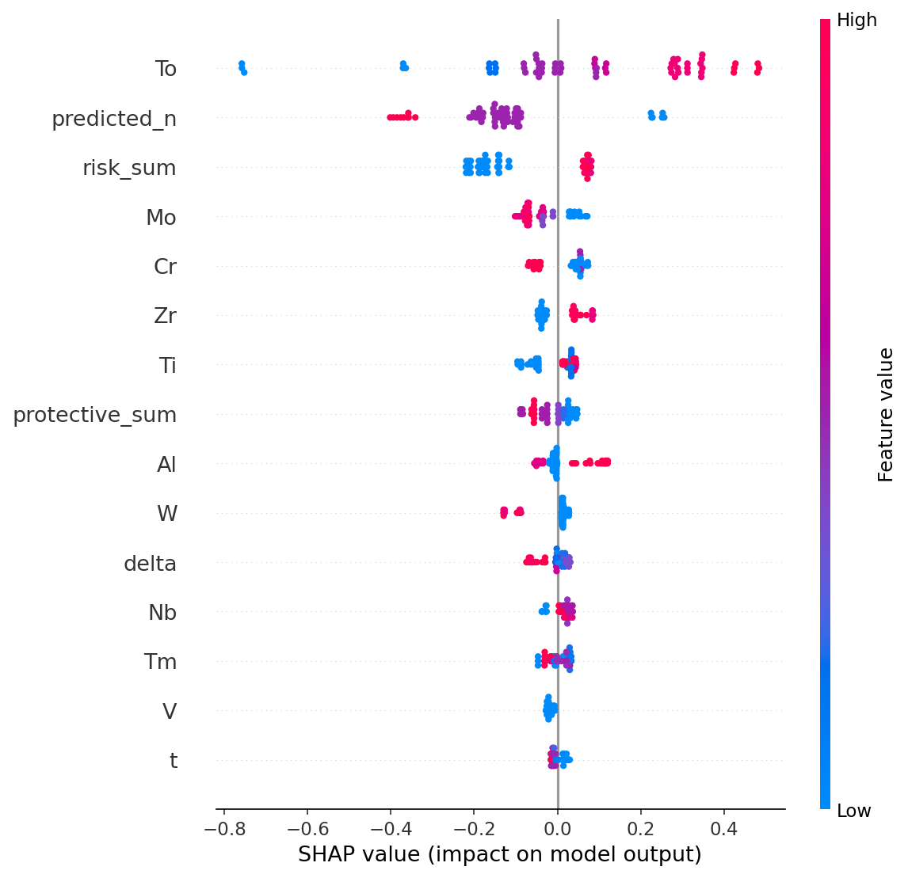
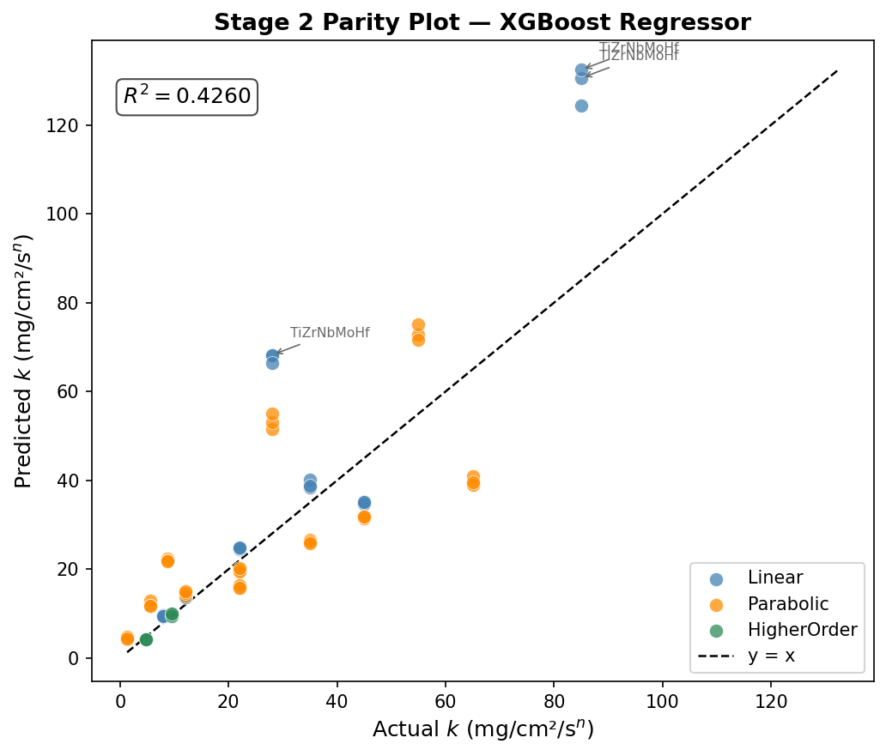
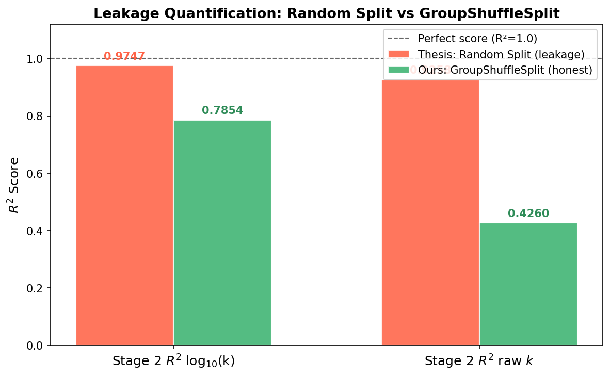

# ML-Guided Oxidation Kinetics Prediction in High-Entropy Alloys

Predicting high-temperature oxidation kinetics of high-entropy alloys (HEAs) with a leakage-aware, two-stage machine learning pipeline — and quantifying how much of the field's reported accuracy comes from data leakage rather than genuine generalization.


## Problem statement

Published ML models for HEA oxidation kinetics are almost universally validated with **random train/test splits**, even though the underlying literature datasets contain multiple measurements (different temperatures, exposure times) per alloy. Because the same alloy composition can appear in both the training and test sets, a random split lets the model partially memorize alloys rather than learn composition → kinetics relationships that generalize to alloys it has never seen.

This project asks: **do published HEA oxidation kinetics models actually generalize to unseen alloys, or is their reported accuracy inflated by this leakage?** It builds a prediction pipeline validated with alloy-grouped splits, and directly measures the size of the inflation by comparing naive and grouped validation on the same data and model.

## Method summary

- **Two-stage cascade pipeline**: an `ExtraTreesClassifier` first predicts the oxidation kinetics regime (linear / parabolic / higher-order), then an `XGBoost` regressor predicts the rate constant, conditioned on the predicted regime.
- **Group-aware validation**: all splits use `GroupShuffleSplit` / `GroupKFold` keyed on alloy identity, so no alloy's measurements appear in both train and test — the honest way to estimate generalization to unseen alloys.
- **Domain-informed feature engineering**: beyond raw composition, engineered features encode known oxidation chemistry, including a *risk-element sum*, a *protective-element sum*, and an *Al–Cr interaction* term (Al and Cr are the two dominant protective-oxide formers in HEAs).
- **Dataset**: 297 literature-mined data points spanning **40 distinct alloy groups**.
- **Leakage quantification**: the same pipeline is re-run under a naive random split and under the grouped split to directly measure how much of the "reported" accuracy is an artifact of split choice (see [`src/leakage_validation`](src/leakage_validation)).

## Key results

| Metric | Value |
|---|---|
| Stage 2 (regression) Test R² | **0.7854** |
| Stage 1 (classification) Macro-F1 | **0.7531** |

**Why grouped validation matters** — the same regression pipeline scored on the same data, under two split protocols:

| Split protocol | Test R² |
|---|---|
| Naive random split | 0.9258 |
| Alloy-grouped split | 0.4260 |

A random split overstates generalization performance by **~0.50 R² units**, because held-out "test" rows can share an alloy with training rows. All headline results in this repo are reported under the grouped protocol.

## Results

<p align="center">
  
  <br><em>SHAP beeswarm — which composition and engineered features drive the model's predictions.</em>
</p>

<p align="center">
  
  <br><em>Actual vs. predicted rate constant on the held-out, alloy-grouped test set.</em>
</p>

<p align="center">
  
  <br><em>Stability check — naive vs. grouped-split R², isolating the leakage effect.</em>
</p>

More plots (confusion matrices, permutation importance, SHAP dependence plots, class distributions) are in [`results/plots`](results/plots); raw metrics/robustness logs are in [`results/metrics`](results/metrics).

## Repository structure

```
.
├── src/                       # pipeline code, grouped by stage
│   ├── analysis.py                  # initial EDA
│   ├── stage1_classification/       # kinetics-regime classifier (ExtraTrees/XGBoost/RF)
│   ├── stage2_regression/           # rate-constant regressor (XGBoost/RF/ExtraTrees)
│   ├── interpretability/            # SHAP beeswarm / dependence / interpretation
│   ├── leakage_validation/          # naive-vs-grouped-split leakage quantification
│   └── plotting/                    # figure-generation scripts for results/plots
├── data/                       # processed dataset + train/test/scaled splits (297 pts, 40 alloy groups)
├── models/                     # trained model checkpoints (regenerated locally, not committed)
├── results/
│   ├── plots/                       # all generated figures
│   └── metrics/                     # robustness / leakage-quantification logs, final predictions
├── docs/
│   ├── report.pdf / report.docx     # full project report
│   ├── slides.pdf                   # presentation deck
│   └── archive/                     # earlier/alternate report version
├── requirements.txt
└── README.md
```

## Documentation

- 📄 Full report: [`docs/report.pdf`](docs/report.pdf)
- 🖥️ Presentation slides: [`docs/slides.pdf`](docs/slides.pdf)

## How to run it

```bash
git clone https://github.com/<your-username>/hea-oxidation-kinetics-prediction.git
cd hea-oxidation-kinetics-prediction
pip install -r requirements.txt
```

The pipeline scripts are numbered/staged and read from `data/`, writing figures to `results/plots/`,
metrics to `results/metrics/`, and trained models to `models/`. Suggested run order:

```bash
python src/analysis.py                                  # EDA (needs raw dataset, see note below)
python src/stage1_classification/task2_split_oversample.py
python src/stage1_classification/stage1_model_selection.py
python src/stage1_classification/task3_xgb.py            # + task3b, task4, task4b for other models/variants
python src/stage2_regression/s2_task1_scale.py
python src/stage2_regression/s2_task2_xgb.py              # + s2_task3, s2_task4 for other models/final eval
python src/interpretability/task_shap_beeswarm.py         # + dependence/interpret scripts
python src/leakage_validation/hea_fixes.py                # naive-vs-grouped leakage quantification
python src/plotting/plot_task1.py                         # + plot_task2-4 for report figures
```

**Note on data**: `data/processed_data.csv` (the cleaned, ready-to-model dataset) and all downstream
train/test splits are included. The *raw* literature-mined dataset used only by `src/analysis.py` for
initial EDA is not part of this repo — supply your own at `data/raw_literature_dataset.csv` to
reproduce that step; everything downstream of `processed_data.csv` runs as-is.

## Acknowledgments

This repository presents my individual analysis and write-up built on a two-person undergraduate
research project at the Department of Materials Science & Engineering, IIT Kanpur, supervised by
Prof. Krishanu Biswas. The accompanying slide deck (`docs/slides.pdf`) is jointly authored with my
project partner, Tanishq Soni.
